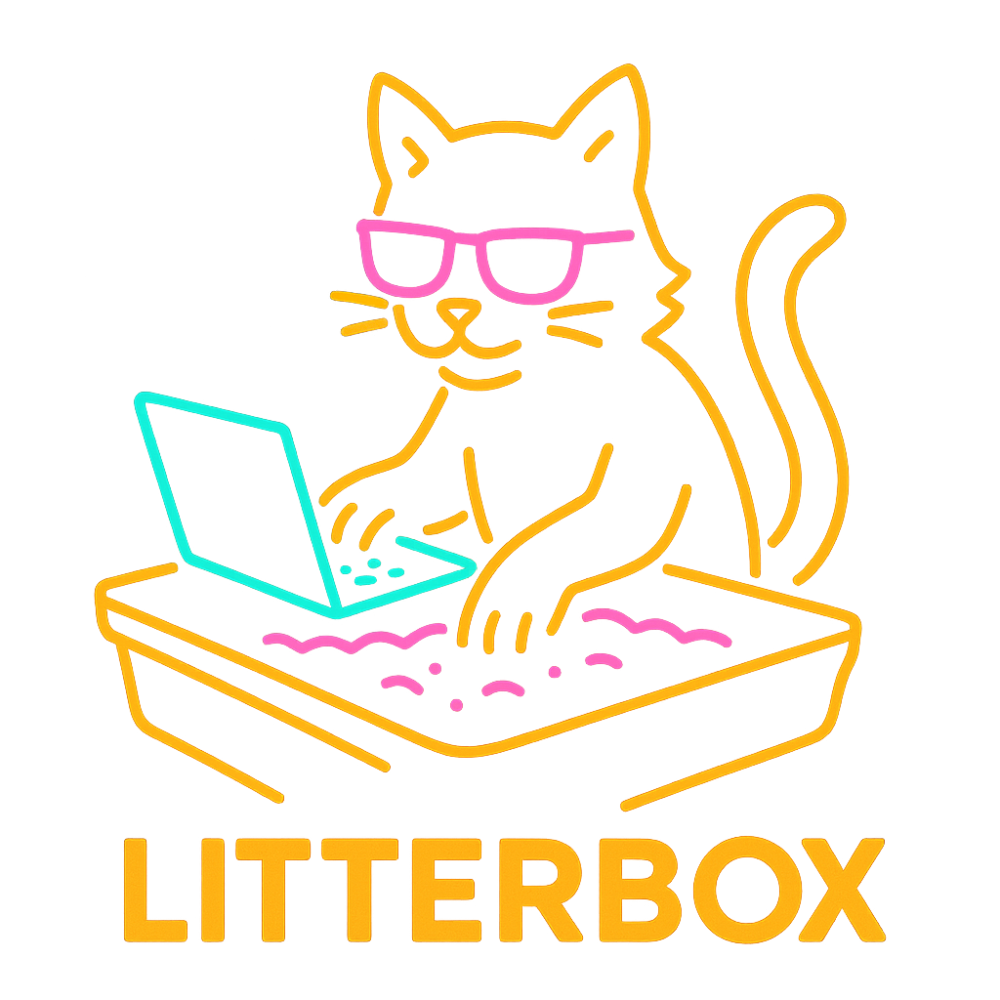

# Litterbox

_Litterbox_ is a sandboxing tool which can run any application in a sandbox and then produce a report on which files the app has tried to access, which network addresses (hosts and IPs) it tried to connect to and which processes it tried to start.

_Litterbox_ works on linux only as it requires `ptrace` apis.

### Sandbox

By default _litterbox_ is very restrictive. It doesn't allow reading or writing from and to files. It prevents creation of new and deletion of existing files and folders. Only file descriptors 0,1,2 are allowed to be read and written to.
Litterbox blocks all outging socket connections and attempts to start a server.
Litterbox blocks spawning of new processes (it doesn't block `clone` or `fork`, but it does block `execve`, etc.)

### Tracing

_Litterbox_ tracks the descriptors across the syscalls and annotatethe calls that use FDs only with actual paths, i.e. it will remember that `open("that/file")`  resulted in a file descriptor 10, so it will add path "that/file" to later calls  to `read(10)`. Same goes for sockets.

Litterbox can snoop on DNS calls to match IP addresses to host names and annotate recvfrom/sendto calls with host names in addition to IP addresses.

### Syscalls

Most of the syscalls are not parsed, litterbox will just match syscall number to name and log that information, together with parameters and result.
Syscalls that require deeper understanding for the purposes of sandboxing are mostly parsed (some or structures can be omitted)

### Reports

_Litterbox_ produces a log (txt or json) with the results of program execution. It will log all syscalls and parse parameters for most interesting ones. 

### Configuration

_Litterbox_ is configured with a toml configuration file and it  supports following configuration options:
 - List of folders where reads are enabled
 - List of folders where writes are enabled (this automatically implies read permissions)
 - List of folders where deletes and renamings are enabled
 - Allow application to delete files and folders created by the application
 - Allow application to change working directory
 - List of applications that can be started
 - List of syscalls that are allowed
 - List of syscalls that are traced

Details TDB